*This project has been created as part of the 42 curriculum by dmena-li, egalindo.*

# TAP — The Answer Protocol

A shared-world, retro text adventure (a small MUD) built around a line-based TCP
protocol. A single server hosts a persistent-feeling world; multiple players
connect at the same time with either a **CLI client** or a **GUI client** and can
explore rooms, chat, fight NPCs, form groups and complete quests in real time.

## Description

The goal of the project is to implement a complete multiplayer text adventure:

- A **server** that loads a static world (`data.yaml`), accepts many concurrent
  clients over TCP and speaks a simple, line-based protocol (`OK` / `ERR` / `EVT`).
- A **CLI client** for text interaction.
- A **GUI client** (built with [Fyne](https://fyne.io/)) for a richer interface.

State lives only in memory: it resets when the server restarts (no persistence
is required).

## Instructions

Requirements:

- **Go** ≥ 1.18 (developed and tested with 1.24).
- For the **GUI** client only (Fyne uses cgo): a C compiler and X11/OpenGL
  development libraries.

```bash
# Fetch Go module dependencies
make install
```

See **Building and Running** below for the full target list.

## Resources

- Go standard library — [`net`](https://pkg.go.dev/net) and
  [`bufio`](https://pkg.go.dev/bufio) packages.
- [Effective Go](https://go.dev/doc/effective_go) and the
  [Go Memory Model](https://go.dev/ref/mem) (goroutines, channels).
- [Fyne toolkit documentation](https://developer.fyne.io/).
- Background on MUDs (Multi-User Dungeons) as the historical inspiration.

**Use of AI:** AI assistance (Claude) was used as a helper for: designing and
documenting the error-code catalog, setting up the build tooling (`Makefile`),
drafting this README, and reviewing the code against the project requirements.
All generated content was reviewed and is understood by the team.

## Architecture

The server uses a **central hub + one goroutine per client** model with channels
for coordination (no shared global mutable state passed around by hand):

- `cmd/server` opens the TCP listener and, for each accepted connection, spawns
  `network.ClientAtender` in its own goroutine.
- `models.Hub` runs in a single goroutine (`Hub.Run`) and owns the maps of
  connected clients and groups. Connections talk to it through channels:
  `Register`, `Unregister` and `Broadcast`. This serializes all global state
  changes and avoids races on the client map.
- Each player has a buffered `MsgChan` and a dedicated `ListenMsg` goroutine that
  writes asynchronous events (`EVT ...`) to that player's socket. This keeps the
  clients responsive while receiving events.
- Per-entity locks (`sync.RWMutex`) protect `Room`, `Player` and `Group` state.

Command handling is **inline dispatch**: `parse.ParseCommandCli` is a `switch`
that validates arguments and calls the matching handler in `src/game`. We chose
inline handling over a dispatcher/router because the command set is small and
fixed, which keeps the flow easy to read and review.

```
cmd/server ──► network.ClientAtender (1 goroutine/client)
                     │
                     ├─ network.Authentication        (CONNECT handshake)
                     ├─ parse.ParseCommandCli ──► src/game/*  (command handlers)
                     └─ player.ListenMsg (1 goroutine/client) ──► EVT events
                     ▲
   models.Hub.Run ───┘  (single goroutine: Register / Unregister / Broadcast)
```

## Protocol Implementation

- Transport: TCP, UTF-8, **one message per line** (`\n` terminated).
- On connect the server greets with `OK hello proto=1`; the client must then send
  `CONNECT <name>` (3–12 letters, unique) before any other command.
- Replies use three line prefixes:
  - `OK <payload>` — success (`payload` may be `key=value` or a JSON object).
  - `ERR <code> <SYMBOL>` — error (see **Error Codes**).
  - `EVT <category> <data>` — asynchronous event (chat, presence, combat, group…).

### Deviations from RFC 42TAP

The RFC leaves many details to each group; the following are our explicit choices
/ deviations and are documented here as required:

- **`REQ`** is a non-standard helper command used by our GUI client to refresh its
  view. It replies with a compact JSON snapshot (`WorldStateResponse`) of the
  current room items, NPCs, inventory and quests. It is specific to our client
  pair and is not part of the standard command set.
- **In-combat attack** is issued with `USE_ITEM` (mapped to the attack action)
  while a player is in the `combat` state; `ATTACK <npc>` is used to *start*
  combat. Additional combat commands `DEFEND` and `FLEE` are our design choice.
- **`WHO`** replies with `OK players=[...]` (the list of connected players).
- **`INVENTORY`** replies with the JSON array of the player's items.

### Error Codes

All error codes are declared in a single source of truth:
`src/speakserver/errors.go`. Every error is one line: `ERR <code> <SYMBOL>` where
`<code>` is a 3-digit number and `<SYMBOL>` is a stable, space-free token.

The first digit groups the error by domain:

| Range | Domain                    |
|-------|---------------------------|
| 1xx   | Protocol / command syntax |
| 2xx   | Session / authentication  |
| 3xx   | World / movement          |
| 4xx   | Items                     |
| 5xx   | NPCs                      |
| 6xx   | Combat                    |
| 7xx   | Quests                    |
| 8xx   | Groups                    |
| 9xx   | Server                    |

| Code | Symbol | Meaning |
|------|--------|---------|
| 100 | `MALFORMED_COMMAND` | The command could not be parsed |
| 101 | `UNKNOWN_COMMAND` | Command not recognized |
| 102 | `MISSING_ARGUMENT` | A required argument is missing |
| 103 | `UNEXPECTED_ARGUMENT` | An argument was given to a command that takes none |
| 104 | `INVALID_ARGUMENT` | The argument value is not valid (bad chat scope, bad group action…) |
| 105 | `MESSAGE_TOO_LONG` | Chat message exceeds the allowed length |
| 200 | `NAME_IN_USE` | The requested name is already connected |
| 201 | `NAME_TOO_SHORT` | Name has fewer than 3 characters |
| 202 | `NAME_TOO_LONG` | Name has more than 12 characters |
| 203 | `NAME_INVALID` | Name contains characters other than letters |
| 204 | `CONNECTION_TIMEOUT` | The connection timed out (auth or inactivity) |
| 300 | `NO_EXIT` | There is no exit in that direction |
| 301 | `NOT_IN_ROOM` | The player is not currently in a room |
| 302 | `PATH_BLOCKED` | An NPC blocks that exit (e.g. Snorlax on the bridge) |
| 400 | `ITEM_NOT_FOUND` | No matching item in the room/inventory |
| 401 | `ITEM_NOT_OBTAINABLE` | The item cannot be taken |
| 402 | `HANDS_FULL` | The player already holds a weapon |
| 500 | `NPC_NOT_FOUND` | No matching NPC in the room |
| 501 | `NPC_NO_DIALOGUE` | The NPC has no dialogue |
| 502 | `NPC_NOT_HOSTILE` | Cannot attack a non-hostile NPC |
| 503 | `NPC_HOSTILE` | Cannot talk to a hostile NPC |
| 600 | `NOT_IN_COMBAT` | The action requires being in combat |
| 601 | `ALREADY_IN_COMBAT` | The NPC is already engaged in combat |
| 602 | `TARGET_GONE` | The combat target no longer exists |
| 603 | `TARGET_DEFEATED` | The NPC is already defeated |
| 604 | `COMMAND_NOT_ALLOWED_IN_COMBAT` | Only USE_ITEM/DEFEND/FLEE/STATUS are allowed in combat |
| 700 | `QUEST_NOT_FOUND` | No quest with that id |
| 701 | `QUEST_ALREADY_ACTIVE` | The quest is already in progress |
| 702 | `QUEST_ALREADY_COMPLETED` | The quest is already completed |
| 703 | `QUEST_NOT_ACTIVE` | The quest is not in progress |
| 704 | `OBJECTIVE_INCOMPLETE` | The quest objective is not yet met |
| 705 | `MISSING_REQUIRED_ITEM` | The required item is not in the inventory |
| 800 | `NOT_IN_GROUP` | The player is not in a group |
| 801 | `ALREADY_IN_GROUP` | The player is already in a group |
| 802 | `GROUP_NOT_FOUND` | No group matches the request |
| 803 | `NOT_GROUP_LEADER` | Only the group leader can perform this action |
| 804 | `USER_NOT_FOUND` | No connected user with that name |
| 900 | `INTERNAL_ERROR` | Unexpected server-side error |

## Combat System

Turn-based, player-initiated combat:

- Players start with **100 HP**. `ATTACK <npc>` starts combat against a hostile
  NPC and puts the player in the `combat` state.
- While in combat the allowed commands are `USE_ITEM` (attack), `DEFEND`, `FLEE`
  and `STATUS`; any other command is rejected with `604`.
- **Damage formula:** combat is fully deterministic (no random component). A hit
  deals exactly the player's current damage: `5` unarmed, or the equipped weapon's
  `dmg` (taking the Thick Bone sets it to `34`). Dropping the weapon resets to the
  unarmed base of `5`.
- **Counter-attack:** after a non-lethal hit the NPC deals its `attack_dmg`
  (Snorlax hits `49`). `DEFEND` halves the incoming damage that turn.
- **FLEE** leaves combat with no damage.
- **Respawn:** a player reaching 0 HP respawns at the safe start room with reduced
  health (`Max_HP - 1`, i.e. 99), satisfying the spec's "reduced health" rule.
- Combat progress is pushed to the player as `EVT COMBAT ...` and victories are
  broadcast to the room.

## Quest System

Quests are defined in `data.yaml` and tracked per player:

- **Types:** `collect` (gather an item), `kill` (defeat an NPC), `explore` (reach a
  room) and `deliver`.
- `QUEST ACCEPT <id>` starts a quest; objective progress is updated automatically
  as the player kills the target NPC, visits the required room or collects the
  required item (`PlayerQuest` flags `NpcKilled` / `RoomVisited` / `ItemCollected`).
- `QUEST COMPLETE <id>` validates the objective; on success it consumes the
  required item (if any) and grants the reward item. Invalid attempts return the
  matching `7xx` error.
- `QUESTS` lists the player's quests with their status and progress.

## World Design

The full player workflow — from spawning in the first room to completing the
main quest — is shown below (diagram source: [`assets/mermaid.txt`](assets/mermaid.txt)):



The world (`data.yaml`) has **8 interconnected rooms** themed around the Kanto
region. It contains **4 items**, **3 NPCs** (two quest-givers and one enemy) and
**2 quests**. The four southern rooms form a closed loop (a full circuit) and the
northern path is an optional branch.

**Core mechanic — a blocked path:** Snorlax sits on the Silence Bridge and blocks
its `NORTH` exit while it is alive, so any `MOVE NORTH` there is rejected with
`PATH_BLOCKED` (302). The player must take the **Thick Bone** (a weapon) from the
Graveyard and defeat Snorlax in combat; once its HP reaches 0 the block clears
automatically and the way north opens. This is data-driven: an NPC declares the
direction it guards via a `blocks_dir` field.

All exits are bidirectional. Directions shown on each link:

```
                  +------------------+
                  |  lavender_town   |
                  | (Lavender Town)  |
                  +--------+---------+
                       N   |   S
 +---------------+   W     +--------+---------+
 |     tower     |<--------|    crossroad     |
 | (Pkmn Tower)  |-------->|(Lavender Crossrd)|
 +---------------+   E     +--------+---------+
                       S   |   N
                  +--------+---------+
                  | silence_bridge   |   <-- Snorlax blocks NORTH
                  | (Silence Bridge) |
                  +--------+---------+
                       N   |   S
                  +--------+---------+   E    +----------------+
                  |    route_11      |------->|  guard_house   |
                  |   (Route 11)     |<-------| (Guard House)  |
                  +--------+---------+   W    +-------+--------+
                       S   |   N                  N   |   S
                  +--------+---------+   E    +-------+--------+
                  |     start        |------->|   graveyard    |
                  | (Vermilion City) |<-------|  (Graveyard)   |
                  +------------------+   W    +----------------+
```

| Room | NPCs | Items |
|------|------|-------|
| start (Vermilion City) | Club President (quest-giver) | — |
| graveyard (Graveyard) | — | Thick Bone (weapon) |
| route_11 (Route 11) | — | — |
| guard_house (Guard House) | — | — |
| silence_bridge (Silence Bridge) | Snorlax (hostile, blocks NORTH) | — |
| crossroad (Lavender Crossroad) | — | Leftovers |
| tower (Pokemon Tower) | — | Cubone's Skull |
| lavender_town (Lavender Town) | Mr. Fuji (quest-giver) | — |

**Items:** Thick Bone (weapon, `dmg 34`), Leftovers, Cubone's Skull, and the Poke
Flute (granted as the main quest reward, not placed in a room).

**Quests:**

- `quest_blocked_path` (deliver) — defeat Snorlax and bring the Leftovers (found
  beyond the bridge) to the Club President; reward: the Poke Flute.
- `quest_tower_mystery` (collect) — retrieve the Cubone's Skull from the Pokemon
  Tower for Mr. Fuji.

## Server Logging

The server emits **structured JSON logs** via the `src/logger` package, built on
the standard library `log` + `encoding/json` (not `log/slog`, so it builds on
Go 1.18). Every entry includes a precise
RFC3339 `time`, a `level` (`INFO` / `WARN` / `ERROR`) and a `msg`, plus
event-specific fields. Logs are written to **stdout**, so they can be piped to a
file or a log collector (e.g. `./bin/tap-server | jq`).

### Log format

```json
{"time":"2026-06-22T18:04:11.512Z","level":"INFO","msg":"command received","player":"alice","addr":"127.0.0.1:53024","cmd":"TAKE","args":"item_thick_bone"}
```

### Event types

| `msg` | Level | Key fields | Trigger |
|-------|-------|------------|---------|
| `server ready` | INFO | `addr` | Server starts listening |
| `connection open` | INFO | `addr` | TCP connection accepted |
| `client registered` | INFO | `name`, `addr` | Successful authentication |
| `auth failed` | WARN | `addr` | Authentication aborted/failed |
| `connection close` | INFO | `name`, `addr` | Client disconnects |
| `command received` | INFO | `player`, `addr`, `cmd`, `args` | Any command from a client |
| `response sent` | INFO | `addr`, `kind` (`OK`/`EVT`), `data` | Server reply / event |
| `error response` | WARN | `addr`, `code`, `sym` | Error code sent to a client |
| `world change` | INFO | `event` (`item_take`, `item_drop`, `npc_defeated`, `player_respawn`), `player`, ... | World state mutation |
| `quest progress` | INFO | `event` (`quest_accept`/`quest_complete`), `player`, `quest` | Quest lifecycle |
| `abuse detected` | WARN | `name`, `addr`, `reason`, `count` | Command flooding |
| `listen failed` / `world load failed` / `scanner error` / `respawn failed` | ERROR | `err`, ... | Internal failures |

### Monitoring abuse

Command flooding is detected per connection: more than `floodThreshold` (20)
commands within a 10-second window emits an `abuse detected` WARN with the
offending player, address and count. Filter the stream with
`./bin/tap-server | jq 'select(.level=="WARN")'` to watch for abuse and errors.

> Output destination: stdout. Client-side connection errors in the CLI/GUI
> binaries remain on `fmt.Println` as they are user-facing, not server logs.

## Group Contributions

| Member | Responsibilities |
|--------|------------------|
| dmena-li | Server implementation, CLI client |
| egalindo | GUI client, world design |

## Building and Running

The build tool is **GNU Make** wrapping the Go toolchain. Available targets:

| Target | Description |
|--------|-------------|
| `make install` | Download module dependencies (`go mod download`) |
| `make build` | Compile server, CLI and GUI into `./bin` |
| `make run-server` | Start the TCP server (listens on `:8080`) |
| `make run-client` | Start the CLI client |
| `make run-client-gui` | Start the GUI client |
| `make lint` | `gofmt` check + `go vet` |
| `make fmt-fix` | Reformat the code with `gofmt -w` |
| `make clean` | Remove built binaries |

Typical session (separate terminals):

```bash
make run-server        # terminal 1
make run-client        # terminal 2
make run-client-gui    # terminal 3
```

## Testing

Multiplayer features are tested manually by running the server and connecting
several clients at once:

- **Presence & chat:** connect two clients, `MOVE` one between rooms and confirm
  the other receives `EVT ROOM PRESENCE ENTER/LEAVE`; send `CHAT GLOBAL/ROOM/GROUP`
  and confirm scope-correct delivery.
- **Items:** `TAKE` an item with one client and confirm it disappears from the
  room for the other (`LOOK`), then `DROP` and confirm it reappears.
- **Combat:** `ATTACK` a hostile NPC, then exercise `USE_ITEM` / `DEFEND` / `FLEE`,
  check `STATUS`, and verify respawn at 0 HP.
- **Quests:** `TALK` to a quest-giver, `QUEST ACCEPT`, fulfil the objective and
  `QUEST COMPLETE`, checking `QUESTS` progress and the reward in `INVENTORY`.
